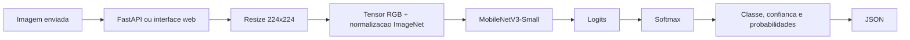

# LeafGuard

O LeafGuard e um sistema de classificacao de imagens de folhas de feijao. Ele recebe uma fotografia, aplica o mesmo preprocessing usado no treinamento, executa uma MobileNetV3-Small e devolve a classe prevista em JSON.

As classes disponiveis sao:

- `angular_leaf_spot`
- `bean_rust`
- `healthy`

Este e um projeto educacional e de portfolio. A resposta do modelo e uma estimativa computacional e nao substitui uma avaliacao agronomica profissional.

## Visao geral do sistema



O projeto possui duas formas de uso:

1. Uma interface web em `/`, adequada para testar imagens manualmente.
2. Uma API REST em `/health` e `/predict`, adequada para integracao com outros sistemas.

As duas formas usam exatamente a mesma funcao `src.predict.predict`. Isso evita que a interface e a API tenham regras diferentes de preprocessing ou carregamento do modelo.

## Como o modelo funciona

### Dados

O treinamento utiliza o dataset Beans, carregado do Hugging Face:

- 1.034 imagens de treino;
- 133 imagens de validacao;
- 128 imagens de teste;
- tres classes aproximadamente equilibradas;
- imagens originais RGB de 500 x 500 pixels.

As imagens nao sao copiadas para o repositorio. O notebook baixa o dataset para o cache local do Hugging Face quando necessario.

### Preprocessing

Antes de entrar na rede, cada imagem passa por:

1. conversao para RGB;
2. redimensionamento para 224 x 224;
3. conversao para tensor PyTorch;
4. normalizacao com media e desvio padrao do ImageNet.

Durante o treino, tambem sao aplicados flip horizontal, rotacao moderada e variacoes de brilho, contraste e saturacao. Essas transformacoes sao aplicadas somente ao treino. Validacao, teste e inferencia usam transformacoes deterministicas para que a medicao seja comparavel.

### Transfer Learning

A MobileNetV3-Small foi carregada com pesos pre-treinados no ImageNet. O backbone ja possui representacoes visuais gerais, como bordas, texturas e formas. Em vez de aprender tudo do zero com apenas 1.034 imagens, o projeto congela o backbone e treina uma nova cabeca para as tres classes de folhas.

A cabeca possui a estrutura:

```text
576 -> Linear(256) -> ReLU -> Dropout(0.2) -> Linear(3)
```

A ultima camada produz tres logits. A funcao Softmax converte esses valores em probabilidades:

```text
probabilidade = softmax(logits)
classe prevista = classe com maior probabilidade
confianca = maior probabilidade
```

### Treinamento e avaliacao

O treinamento usa Cross-Entropy Loss e o otimizador Adam. O melhor estado do modelo e salvo conforme a accuracy de validacao, em vez de simplesmente usar a ultima epoca.

Resultado registrado:

- melhor validacao: **90,98%** na epoca 11;
- teste: **87,50% de accuracy**;
- teste: **87,60% de F1 ponderado**;
- checkpoint: `artifacts/mobilenetv3_beans_best.pt`.

Consulte `notebooks/01_exploracao.ipynb` para a exploracao, validacao dos DataLoaders, treinamento e avaliacao detalhada.

## Arquitetura de software

```text
src/data.py       Leitura dos splits, transforms e DataLoaders
src/model.py      MobileNetV3-Small, cabeca e congelamento do backbone
src/train.py      Funcoes de treino e validacao por epoca
src/evaluate.py   Accuracy, precision, recall, F1 e matriz de confusao
src/predict.py    Carregamento do checkpoint e inferencia de uma imagem
api/main.py       Aplicacao FastAPI e endpoints HTTP
api/static/       Interface web HTML, CSS e JavaScript
tests/            Testes unitarios e de integracao
artifacts/        Checkpoint treinado usado pela API
```

## Interface web

Com a API em execucao, abra:

```text
http://localhost:8000/
```

A interface permite:

1. escolher um arquivo de imagem ou arrasta-lo para a area de upload;
2. visualizar a imagem antes do envio;
3. clicar em `Classificar imagem`;
4. visualizar a classe prevista;
5. visualizar a confianca e as probabilidades das tres classes.

O navegador envia o arquivo como `multipart/form-data` para `POST /predict`. O resultado e renderizado no painel sem recarregar a pagina.

## API REST

### Health check

```bash
curl http://localhost:8000/health
```

Resposta:

```json
{"status": "ok"}
```

### Predicao

```bash
curl -X POST http://localhost:8000/predict \
  -F "file=@caminho/para/folha.jpg"
```

O endpoint valida o tipo MIME, le os bytes, converte a imagem para RGB, aplica o preprocessing e executa a inferencia sem gradientes. O modelo e mantido em cache na memoria para nao recarregar o checkpoint a cada requisicao.

Resposta:

```json
{
  "class_name": "bean_rust",
  "confidence": 0.91,
  "probabilities": {
    "angular_leaf_spot": 0.03,
    "bean_rust": 0.91,
    "healthy": 0.06
  }
}
```

Erros principais:

- `400`: arquivo vazio ou imagem invalida;
- `415`: arquivo enviado nao e uma imagem;
- `422`: campo `file` ausente na requisicao.

A especificacao interativa fica em:

```text
http://localhost:8000/docs
```

## Instalacao e execucao local

Requisitos:

- Python 3.12;
- internet na primeira execucao para baixar dependencias e o dataset do notebook;
- aproximadamente 4,2 MB para o checkpoint treinado, alem das bibliotecas Python.

Comandos:

```bash
python -m venv .venv
source .venv/bin/activate
pip install -r requirements.txt
uvicorn api.main:app --reload
```

Depois abra `http://localhost:8000/`.

## Docker

O `Dockerfile` cria uma imagem com Python 3.12, dependencias, codigo da API e checkpoint. O notebook e o dataset nao sao necessarios para inferencia dentro do container.

```bash
docker build -t leafguard-api .
docker run --rm -p 8000:8000 leafguard-api
```

Depois use:

```text
http://localhost:8000/
http://localhost:8000/docs
```

Para verificar o container:

```bash
docker ps
curl http://localhost:8000/health
```

## Testes

Execute na raiz do projeto:

```bash
pytest -q
```

Os testes cobrem:

- formato da resposta de inferencia;
- classes conhecidas e confianca entre 0 e 1;
- soma das probabilidades aproximadamente igual a 1;
- endpoint `/health`;
- rejeicao de arquivos que nao sao imagens;
- upload multipart no endpoint `/predict`.

## O que nao deve ser versionado

O `.gitignore` exclui ambientes virtuais, caches, bytecode, checkpoints automaticos do Jupyter, logs e resultados experimentais temporarios. O checkpoint oficial em `artifacts/mobilenetv3_beans_best.pt` permanece no projeto porque e necessario para executar a API e construir a imagem Docker.

O `.dockerignore` exclui notebooks, ambiente virtual, caches e documentacao do contexto da imagem, mantendo somente o codigo, as dependencias e o checkpoint necessarios ao servico.

## Limitacoes e proximos passos

- O dataset e pequeno e possui um dominio visual especifico.
- A confianca da rede nao e uma garantia de certeza estatistica.
- Imagens fora do dominio, com baixa iluminacao ou folhas parcialmente ocultas podem gerar erros.
- A API ainda nao possui autenticacao, rate limiting, monitoramento ou armazenamento de historico.
- Um proximo experimento pode descongelar as camadas finais para fine-tuning.
- Uma versao de producao deveria adicionar validacao de tamanho de arquivo, observabilidade e um mecanismo de atualizacao do modelo.
